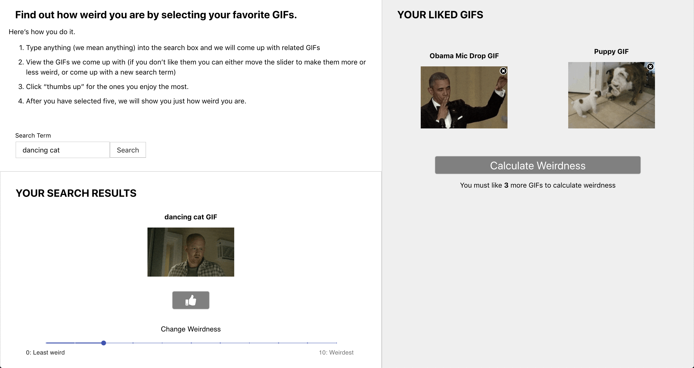

<h1 align="center"> Weirdness Calculator </h1>  

  Using GIFs to find out how weird you are since November 2019.

## Table of Contents

- [Introduction](#introduction)
- [Features](#features)
- [Feedback](#feedback)
- [Contributors](#contributors)
- [Build Process](#build-process)
- [Backers](#backers-)
- [Sponsors](#sponsors-)
- [Acknowledgments](#acknowledgments)

## Introduction

Use the Giphy API to find GIFs.  You can select 5 GIFs that you like and we will tell you how weird you are based on your selections.

## Features

A few of the things you can do with Weirdness Calculator:

* Search for GIFs using any search term.
* Once you get a GIF you can tell us how weird you want it and we'll give you one that matches your request
* Add GIFs to your favorites
* Remove GIFs from favorites
* Calculate how weird you are based on your selections
* Start over again!

  

## Contributors

Just me - Dustin Haefele

## Build Process - need to update

- Clone or download the repo
- `yarn` to install dependencies
- `yarn run link` to link react-native dependencies
- `yarn start:ios` to start the packager and run the app in the iOS simulator (`yarn start:ios:logger` will boot the application with [redux-logger](<https://github.com/evgenyrodionov/redux-logger>))
- `yarn start:android` to start the packager and run the app in the the Android device/emulator (`yarn start:android:logger` will boot the application with [redux-logger](https://github.com/evgenyrodionov/redux-logger))

Please take a look at the [contributing guidelines](./CONTRIBUTING.md) for a detailed process on how to build your application as well as troubleshooting information.

**Development Keys**: The `CLIENT_ID` and `CLIENT_SECRET` in `api/index.js` are for development purposes and do not represent the actual application keys. Feel free to use them or use a new set of keys by creating an [OAuth application](https://github.com/settings/applications/new) of your own. Set the "Authorization callback URL" to `gitpoint://welcome`.

## Acknowledgments

Thanks to [Politech](http://www.politech.io/) for allowing me to complete this coding challenge, to [GiphyAPI](https://developers.giphy.com/docs/api/endpoint#translate) for the API usage and this project was bootstrapped with [Create React App](https://github.com/facebook/create-react-app).

This project was bootstrapped with [Create React App](https://github.com/facebook/create-react-app).

## Available Scripts

In the project directory, you can run:

### `npm start`

Runs the app in the development mode. 
Open [http://localhost:3000](http://localhost:3000) to view it in the browser.

The page will reload if you make edits. 
You will also see any lint errors in the console.

### `npm test`

Launches the test runner in the interactive watch mode. 
See the section about [running tests](https://facebook.github.io/create-react-app/docs/running-tests) for more information.

### `npm run build`

Builds the app for production to the `build` folder. 
It correctly bundles React in production mode and optimizes the build for the best performance.

The build is minified and the filenames include the hashes. 
Your app is ready to be deployed!

See the section about [deployment](https://facebook.github.io/create-react-app/docs/deployment) for more information.

### `npm run eject`

**Note: this is a one-way operation. Once you `eject`, you can’t go back!**

If you aren’t satisfied with the build tool and configuration choices, you can `eject` at any time. This command will remove the single build dependency from your project.

Instead, it will copy all the configuration files and the transitive dependencies (Webpack, Babel, ESLint, etc) right into your project so you have full control over them. All of the commands except `eject` will still work, but they will point to the copied scripts so you can tweak them. At this point you’re on your own.

You don’t have to ever use `eject`. The curated feature set is suitable for small and middle deployments, and you shouldn’t feel obligated to use this feature. However we understand that this tool wouldn’t be useful if you couldn’t customize it when you are ready for it.

